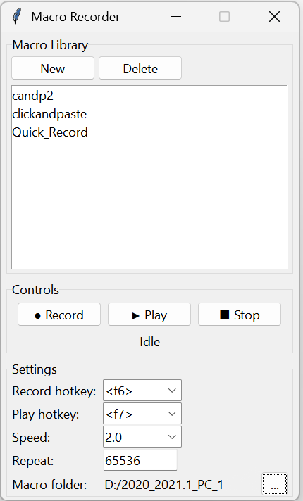

# 🖱️ My Automatic Mouse Clicker, Scroller, Keyboard Clicker.

<p align="center">
  <strong>RECORD! PLAY! REPEAT!</strong>
</p>

<p align="center">
  <a href="LICENSE"></a>
</p>

**My Automatic Mouse Clicker, Scroller, Keyboard Clicker** is an opensource _personal macro automation tool_ you run on your Windows device.
It allows you to record complex sequences of mouse clicks, scroll events, and keyboard inputs, and replay them flawlessly whenever you need.

If you want a simple, local, and reliable macro recorder that gets out of your way, this is it.

<p align="center">
  
</p>

## Quick start (TL;DR)
Runtime: **Python 3.10+**.

```bash
git clone https://github.com/somethingx1202/Automatic-Mouse-Clicker-Scroller-Keyboard-Clicker.git
cd Automatic-Mouse-Clicker-Scroller-Keyboard-Clicker
pip install -r requirements.txt
```

Start the application:

```bash
python main.py
```

1. Press **F6** (or your configured record hotkey) to start recording.
2. Perform your sequence (e.g., Left click, Scroll down, Right click, `Ctrl + V`, `Enter`).
3. Press **F6** again to instantly stop and save your sequence as `Quick_Record`.
4. Set your desired **Repeat** count in the UI.
5. Press **F7** (or your configured play hotkey) to replay the macro seamlessly!

## Highlights

- **Local-first** — all macros and settings are stored locally on your machine.
- **True Coordinate Accuracy** — features built-in Windows DPI awareness to ensure your clicks land exactly where they were recorded.
- **Smart Key Mapping** — safely handles control characters and dead keys, ensuring keyboard shortcuts like `Ctrl + V` or `Ctrl + C` playback properly.
- **Customizable Hotkeys** — configure your own global hotkeys to start/stop recording and playback without needing to tab back into the app.
- **Configurable Playback Speed** — replay your macros at 0.5x, 1.0x, or even 2.0x speed.
- **Looping** — repeat your recorded sequences up to billions of times sequentially.

## How it works (short)

```
Keyboard / Mouse Activity
               │
               ▼
┌───────────────────────────────┐
│        Macro Recorder         │
│          (app.py)             │
└──────────────┬────────────────┘
               │
               ├─ pynput listener (records)
               ├─ pynput controller (replays)
               ├─ JSON Storage (~/mouse_macros/)
               └─ tkinter GUI
```

## Key subsystems

- **Recording Engine** — utilizes `pynput` listeners to capture mouse (clicks/scrolls) and keyboard events while mapping special control characters securely.
- **Playback Engine** — utilizes `pynput` controllers, implementing asynchronous thread sleeps to mitigate coordinate race conditions with the OS cursor system.
- **Macro Library** — easily delete or inspect older macros stored as standard JSON.

## Configuration

Settings are saved automatically to `~/mouse_macros/settings.json`.

```json5
{
  "record_hotkey": "<f6>",
  "play_hotkey": "<f7>",
  "speed": 1.0,
  "repeat_count": 1,
  "macro_folder": "C:\Users\YourName\mouse_macros"
}
```

## Development

To work on this project or run the tests:

```bash
pip install -r requirements-dev.txt
pytest tests/ -v
```

## Contributors

- [@somethingx1202](https://github.com/somethingx1202)
- [@gemini-cli](https://github.com/apps/gemini-cli)
